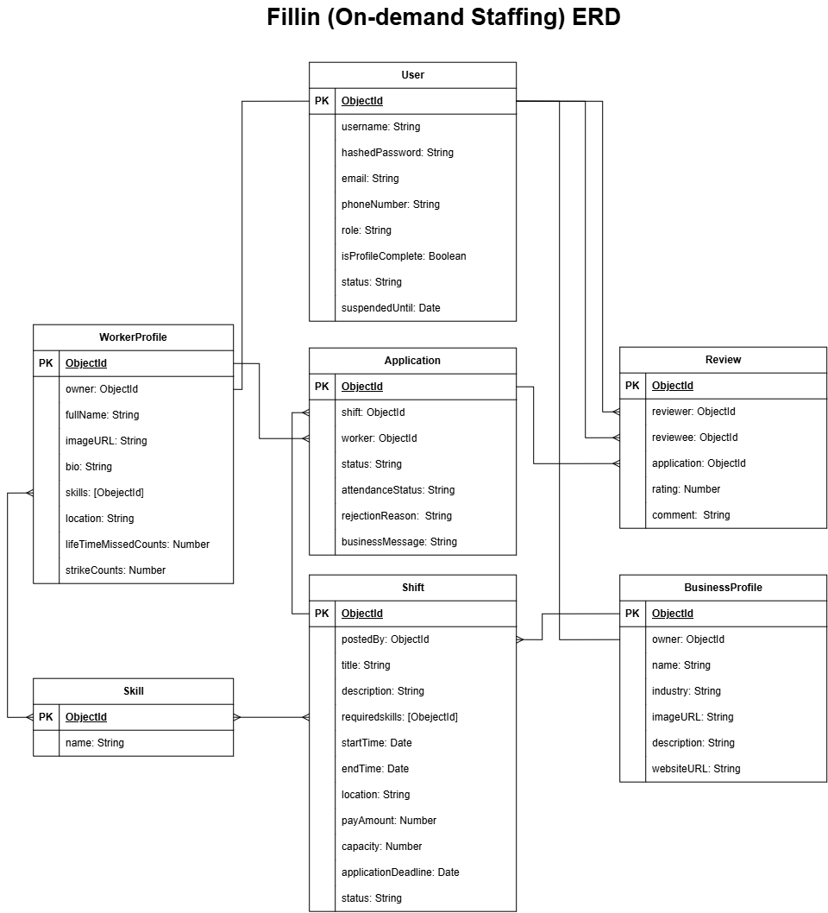

# FillIn Backend API

## Overview

This repository contains the Node.js, Express, and MongoDB backend for the **On Demand Staffing** application, a platform that connects **businesses** posting shift-based work with **workers** who apply for and complete those shifts. It handles authentication, profile management, shift postings, applications, attendance tracking, worker reliability/suspension logic, and post-shift reviews.

## Related Links

- **Backend API:** Deployed Backend URL
- **Frontend Application:** Deployed Frontend URL
- **Frontend Repository:** https://github.com/Zaraaa82/Fillin-frontend

## Technologies Used

- Node.js
- Express 5
- MongoDB
- Mongoose
- JSON Web Tokens (JWT)
- bcrypt
- dotenv
- Morgan
- cors
- express-rate-limit
- validator
- Jest
- Supertest

## Features

- User registration and login with role selection (`worker` or `business`)
- JWT-based authentication middleware
- Role- and ownership-based authorization (worker-only, business-only, resource-owner, and application-participant checks)
- Separate worker and business profiles, each required to be completed before posting/applying to shifts
- Shift CRUD with skill requirements, capacity, pay, location, and application deadlines
- Automatic shift status lifecycle (`open` → `filled`/`closed` → `in-progress` → `completed`, or `cancelled`), recalculated on each request to the shifts/applications routes
- Shift application workflow: apply, withdraw, accept, reject, cancel an accepted assignment, and record attendance
- Automatic detection and withdrawal of conflicting applications when a worker's schedule overlaps
- Skill-match percentage calculated for each application (required shift skills vs. worker skills)
- Worker reliability tracking: missed shifts accrue strikes, and a worker is automatically suspended for a fixed period after repeated misses, then reactivated once the suspension expires
- Post-shift reviews between workers and businesses, restricted to completed/attended applications
- Aggregated profile statistics (average rating, completed shift count, reliability percentage)
- Request validation and MongoDB ObjectId validation on relevant routes
- Rate limiting middleware (`middleware/rateLimiters.js`) available for standard and auth traffic
- Clear error handling with proper HTTP status codes
- Automated API tests with an isolated test database

## Project Structure

```text
backend/
├── config/
├── controllers/
├── middleware/
├── models/
├── routes/
├── seed/
├── services/
├── tests/
├── app.js
└── server.js
```

### Folder Responsibilities

| Folder        | Purpose                                                      |
| ------------- | ------------------------------------------------------------- |
| `config`      | Database connection setup                                     |
| `controllers` | HTTP request and response handling                            |
| `middleware`  | Authentication, authorization, validation, and rate limiting  |
| `models`      | Mongoose schemas and models                                   |
| `routes`      | Express route definitions                                     |
| `seed`        | Scripts to populate the database with sample data             |
| `services`    | Business logic shared across controllers (shift status, applications, statistics, worker suspension) |
| `tests`       | Automated tests                                                |
| `app.js`      | Express application configuration                             |
| `server.js`   | Database connection and server startup                        |

## Getting Started

### Prerequisites

Install:

- Node.js
- MongoDB locally or a MongoDB Atlas account

## Installation

### 1. Clone the repository

```bash
git clone BACKEND_REPOSITORY_URL
cd backend
```

### 2. Install dependencies

```bash
npm install
```

### 3. Create the environment file

Create `.env` in the `backend` root directory:

```env
PORT=3000
MONGODB_URL=your-connection-string
CLIENT_URL=http://localhost:5173
JWT_SECRET=unique-password-no-one-would-guess
```

> Note: the test suite reads from a separate `.env.test` file and expects a `MONGODB_URI` variable pointing at a dedicated test database, e.g.
>
> ```env
> MONGODB_URI=your-test-connection-string
> ```

### 4. (Optional) Seed the database

```bash
npm run seed
```

### 5. Start the development server

```bash
npm run dev
```

The API is available at:

```text
http://localhost:3000
```

## Database Models

### User

| Field         | Type    | Rules                                        |
| ------------- | ------- | --------------------------------------------- |
| `username`    | String  | Required, unique, trimmed, lowercase          |
| `hashedPassword` | String | Required, hashed with bcrypt, hidden from JSON output |
| `email`       | String  | Required, unique, lowercase, trimmed          |
| `phoneNumber` | String  | Required, unique, trimmed                     |
| `role`        | String  | Required, `worker` or `business`              |
| `isProfileComplete` | Boolean | Default `false`, set `true` once a worker/business profile is created |
| `status`      | String  | `active` or `suspended`, default `active`     |
| `suspendedUntil` | Date | Date the suspension lifts, `null` when active |
| `createdAt` / `updatedAt` | Date | Generated automatically         |

### BusinessProfile

| Field         | Type     | Rules                                                |
| ------------- | -------- | ------------------------------------------------------ |
| `owner`       | ObjectId | Required, unique, references `User`                    |
| `name`        | String   | Required, trimmed                                       |
| `industry`    | String   | Required, one of a fixed set (restaurant, cafe, hotel, catering, event venue, wedding, exhibition & conference, retail, supermarket, other) |
| `imageURL`    | String   | Required, trimmed                                       |
| `description` | String   | Required, trimmed                                       |
| `websiteURL`  | String   | Optional, trimmed                                       |
| `createdAt` / `updatedAt` | Date | Generated automatically                    |

### WorkerProfile

| Field         | Type       | Rules                                             |
| ------------- | ---------- | ---------------------------------------------------- |
| `owner`       | ObjectId   | Required, unique, references `User`                  |
| `fullName`    | String     | Required, trimmed, max 100 characters                |
| `imageURL`    | String     | Required, trimmed                                     |
| `bio`         | String     | Optional, trimmed, default `''`                       |
| `skills`      | [ObjectId] | References `Skill`, at least one required             |
| `location`    | String     | Required, trimmed                                     |
| `lifetimeMissedCount` | Number | Default `0`, minimum `0`                        |
| `strikeCount` | Number     | Default `0`, `0`–`2` (resets on suspension)            |
| `createdAt` / `updatedAt` | Date | Generated automatically                     |

### Shift

| Field         | Type       | Rules                                                             |
| ------------- | ---------- | -------------------------------------------------------------------- |
| `postedBy`    | ObjectId   | Required, references `BusinessProfile`                               |
| `title`       | String     | Required, trimmed                                                    |
| `description` | String     | Required, trimmed                                                    |
| `requiredSkills` | [ObjectId] | References `Skill`, at least one required                        |
| `startTime`   | Date       | Required                                                              |
| `endTime`     | Date       | Required, must be later than `startTime`                             |
| `location`    | String     | Required                                                              |
| `payAmount`   | Number     | Required, minimum `10`                                               |
| `capacity`    | Number     | Required, minimum `1`                                                |
| `applicationDeadline` | Date | Required, must be before `startTime`                             |
| `status`      | String     | `open`, `filled`, `cancelled`, `completed`, `closed`, or `in-progress`, default `open` |
| `createdAt` / `updatedAt` | Date | Generated automatically                                    |

### Application

| Field         | Type     | Rules                                                                    |
| ------------- | -------- | --------------------------------------------------------------------------- |
| `shift`       | ObjectId | Required, references `Shift`                                                |
| `worker`      | ObjectId | Required, references `WorkerProfile`; unique together with `shift`          |
| `status`      | String   | `pending`, `accepted`, `rejected`, `withdrawn`, `completed`, or `cancelled`, default `pending` |
| `attendanceStatus` | String | `not-applicable`, `pending`, `attended`, or `missed`, default `not-applicable` |
| `rejectionReason` | String | Trimmed, set when rejected                                              |
| `businessMessage` | String | Trimmed, optional message set on acceptance                             |
| `createdAt` / `updatedAt` | Date | Generated automatically                                            |

### Review

| Field       | Type     | Rules                                                        |
| ----------- | -------- | ----------------------------------------------------------------- |
| `reviewer`  | ObjectId | Required, references `User`                                       |
| `reviewee`  | ObjectId | Required, references `User`, must differ from `reviewer`          |
| `application` | ObjectId | Required, references `Application`; unique together with `reviewer` |
| `rating`    | Number   | Required, `1`–`5`                                                  |
| `comment`   | String   | Required, trimmed                                                  |
| `createdAt` / `updatedAt` | Date | Generated automatically                                |

### Skill

| Field | Type   | Rules                              |
| ----- | ------ | ----------------------------------- |
| `name` | String | Required, unique, trimmed, lowercase |
| `createdAt` / `updatedAt` | Date | Generated automatically  |

## Entity Relationships

- A `User` has one `WorkerProfile` **or** one `BusinessProfile`, depending on `role`.
- A `BusinessProfile` posts many `Shift`s.
- A `Shift` requires many `Skill`s and receives many `Application`s.
- A `WorkerProfile` has many `Skill`s and submits many `Application`s.
- An `Application` links one `Shift` to one `WorkerProfile`.
- A `Review` is left on a completed `Application`, from one `User` to another.



## API Base URL

Local development:

```text
http://localhost:3000
```

Production:

```text
https://your-deployed-api.com
```

## Endpoints

### Auth

| Method | Endpoint       | Access        | Description                            |
| ------ | -------------- | ------------- | --------------------------------------- |
| `POST` | `/auth/sign-up`| Public        | Register a new user                     |
| `POST` | `/auth/sign-in`| Public        | Log in and receive a JWT                |
| `GET`  | `/auth/me`     | Authenticated | Get the current user's profile          |

### Skills

| Method | Endpoint  | Access | Description        |
| ------ | --------- | ------ | ------------------- |
| `GET`  | `/skills` | Public | Get all skills      |

### Business Profiles

| Method | Endpoint                    | Access          | Description                       |
| ------ | ---------------------------- | --------------- | ---------------------------------- |
| `POST` | `/business-profiles`         | Business        | Create the caller's business profile |
| `PUT`  | `/business-profiles`         | Business (owner) | Update the caller's business profile |
| `GET`  | `/business-profiles/me`      | Business        | Get the caller's business profile  |
| `GET`  | `/business-profiles/:id`     | Public          | Get a business profile by id       |

### Worker Profiles

| Method | Endpoint                  | Access         | Description                      |
| ------ | -------------------------- | -------------- | --------------------------------- |
| `POST` | `/worker-profiles`         | Worker         | Create the caller's worker profile |
| `PUT`  | `/worker-profiles`         | Worker (owner) | Update the caller's worker profile |
| `GET`  | `/worker-profiles/me`      | Worker         | Get the caller's worker profile   |
| `GET`  | `/worker-profiles/:id`     | Authenticated  | Get a worker profile by id        |

### Shifts

| Method   | Endpoint                | Access            | Description                                     |
| -------- | ------------------------ | ----------------- | ------------------------------------------------ |
| `GET`    | `/shifts`                | Public            | Get all non-cancelled shifts                     |
| `GET`    | `/shifts/business/:id`   | Public            | Get shifts posted by a business (owner also sees cancelled) |
| `GET`    | `/shifts/:id`             | Public            | Get one shift by id (owner also sees it if cancelled) |
| `POST`   | `/shifts`                 | Business (profile complete) | Create a shift                        |
| `PUT`    | `/shifts/:id`             | Business (owner)  | Update a shift                                   |
| `DELETE` | `/shifts/:id`             | Business (owner)  | Cancel a shift                                   |

### Applications

| Method | Endpoint                              | Access                       | Description                                  |
| ------ | --------------------------------------- | ------------------------------ | ---------------------------------------------- |
| `POST` | `/applications/shifts/:id`              | Worker (active, profile complete) | Apply to an open shift                    |
| `GET`  | `/applications/shifts/:id`              | Business (shift owner)         | Get all applications for a shift              |
| `GET`  | `/applications/me`                      | Worker                         | Get the caller's applications                 |
| `GET`  | `/applications/business/me`             | Business                       | Get all applications across the caller's shifts |
| `GET`  | `/applications/:id`                     | Application participant        | Get one application by id                     |
| `PUT`  | `/applications/:id/withdraw`            | Worker (applicant)             | Withdraw a pending application                |
| `PUT`  | `/applications/:id/cancel-assignment`   | Application participant        | Cancel an accepted assignment before the shift starts |
| `PUT`  | `/applications/:id/accept`              | Business (shift owner)         | Accept a pending application                  |
| `PUT`  | `/applications/:id/reject`              | Business (shift owner)         | Reject a pending application (reason required) |
| `PUT`  | `/applications/:id/attendance`          | Business (shift owner)         | Record attendance (`attended`/`missed`) after the shift completes |

### Reviews

| Method   | Endpoint                    | Access               | Description                                  |
| -------- | ----------------------------- | ---------------------- | ---------------------------------------------- |
| `POST`   | `/reviews/applications/:id`   | Application participant | Leave a review on a completed, attended application |
| `GET`    | `/reviews/worker/:id`         | Authenticated          | Get all reviews for a worker                  |
| `GET`    | `/reviews/business/:id`       | Authenticated          | Get all reviews for a business                |
| `PUT`    | `/reviews/:id`                | Review owner           | Update the caller's review                    |
| `DELETE` | `/reviews/:id`                | Review owner           | Delete the caller's review                    |

## Status Codes

| Status | Meaning in this API                |
| -----: | ------------------------------------ |
|  `200` | Successful request                   |
|  `201` | Resource created                     |
|  `204` | Successful deletion with no body     |
|  `400` | Invalid request                      |
|  `401` | Authentication required or invalid   |
|  `403` | Authenticated but not permitted      |
|  `404` | Resource not found                   |
|  `409` | Resource conflict                    |
|  `500` | Unexpected server error              |

## Testing

Run tests:

```bash
npm test
```

Tests use Jest and Supertest against a dedicated test database configured via `.env.test` (`MONGODB_URI`), separate from the development database used by the running server.

## Future Enhancements

## Team Members

| Name         | GitHub           | Responsibilities       |
| ------------ | ----------------- | ------------------------ |
| Zahraa Alaiwi | [GitHub profile]  |             |
| Bushra Husain | [GitHub profile]  |    |

## Credits
